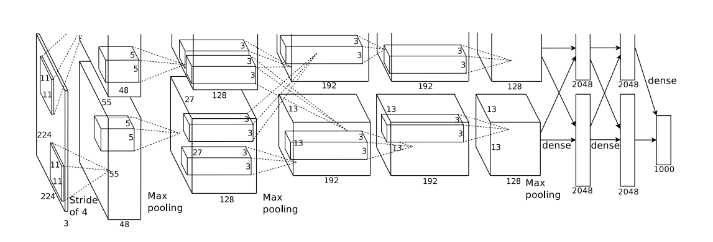

# AlexNet

### Paper: ImageNet Classification with Deep Convolutional Neural Networks

### Network Architecture:

---

notice this architecture is a bit different than the original one, with 3 extra conv layers added.](readme_imgs/Untitled%201.png)

credit: [https://www.kaggle.com/blurredmachine/alexnet-architecture-a-complete-guide](https://www.kaggle.com/blurredmachine/alexnet-architecture-a-complete-guide)
notice this architecture is a bit different than the original one, with 3 extra conv layers added.

### Dataset:

---

**ILSVRC**: Uses a subset of ImageNet, 1000 categories, each category roughly 1000 training images. Overall 1.2 million training images, 50,000 validation images, and 150,000 test images.

### Questions:

---

**What does "subtracting the mean activity over the training set" mean?**

**Why?**

**What is saturating?**

**Didn't understand the normalization below, how does this normalization come up, and what is the diff between BatchNorm and this normalization? Is it used in other models?**

**What does 10-bits of constraints mean?**

**Why adding principal components to training images? How does that augment images? Does this method used in other places?**

### Related:

---

- **Why is real-world visual object recognition hard?** - "Shortcomings of small image datasets have been widely recognized (e.g., Pinto et al. [21])"
- **Multi-column deep neural networks for image classification** - "The current best error rate on the MNIST digit-recognition task (<0.3%) approaches human performance"
- **Rectified linear units improve restricted Boltzmann machines** - "Following Nair and Hinton [20], we refer to neurons with this nonlinearity as Rectified Linear Units (ReLUs)"
- **What is the best multi-stage architecture for object recognition?** - "For example, Jarrett et al. [11] claim that the nonlinearity f(x) = |tanh(x)| works particularly well with their type of contrast normalization followed by local average pooling on the Caltech-101 dataset."
- **High-performance neural networks for visual object classification** - "The resultant architecture is somewhat similar to that of the “columnar” CNN employed by Cire¸san et al. [5]"
- **Lessons from the netflix prize challenge** | **Random forests** - "Combining the predictions of many different models is a very successful way to reduce test errors [1, 3], but it appears to be too expensive for big neural networks that already take several days to train."

### Implementation & Tricks:

---

- **Local Response Normalization:**
    - Layer Formula:
        
        
        
    - Position: After First and Second Conv Layer
    - Effect: Reduce top-1 error rate by 1.4%, top-5 error rate by 1.2%
- **Overlapping Max Pooling: (special)**
    - The paper specifically mentioned overlapping max-pooling instead of regular max-pooling (stride=kernel_size).
    - Stride = 2 and kernel_size = 3
    - Effect: Reduce top-1 error rate by 0.4%, top-5 error rate by 0.3%
- **Data Augmentation:**
    - Method:
        - 1: Crop random 224x224 from 256x256 input, and randomly horizontally flip.
        - 2: Perform PCA on the set of RGB pixel values throughout the ImageNet training set. 
        And for each RGB pixel, add,
            
            
            
    - Increased training set by a factor of 2048.
    - Use CPU to generate augmentation and train them on the fly (not need to store on disk), does not affect GPU computation.
    - At test time, crop four corners plus one center 224x224 patch from 256x256 input, as well as their horizontal flip, resulting in 10 inputs and average their final result in softmax layer.
    - Effect:
        - Method 1: Did not mention.
        - Method 2: Reduce top-1 error rate by 1%.
- **Drop Out:**
    - Setting dropout rate to 0.5, so the neurons get dropped out will not contribute to the forward pass as well as backpropagation.
    - Forced to learn more robust features that are useful in conjunction with many different random subsets of the other neurons.
    - At test time, use all neurons (no dropout), but multiply their output by 0.5.
    - Position: After the first and the second fully connected layer.
    - Effect: substantially reduce overfitting, but roughly doubles the iterations required to converge.
- **Implementation:**

[Google Colaboratory](https://colab.research.google.com/drive/18l6UtyTiOACSRO7MBcu6xJi-VSEiggOa#scrollTo=g1GTn3maVOAO)

Results:

Without Dropout(0.5d

---

With Dropout(0.5)

### Training:

---

- **Optimizer**: SGD
- **Batch Size:** 128
- **Momentum**: 0.9
- **Weight Decay**: 0.0005 (important for model to learn)
- **Weight Initialization**: Gaussian distribution with mean = 0 and std dev = 0.01
- **Bias Initialization**: constant 1, in conv layer 2, 4, 5 and all fully connected layers. Remaining layer initialized to constant 0.
- **Learning Rate**: Initialized at 0.01, divide learning rate by 10 when the validation error rate stopped improving.
- **Epochs**: 90 (paper mentioned 90 cycles)